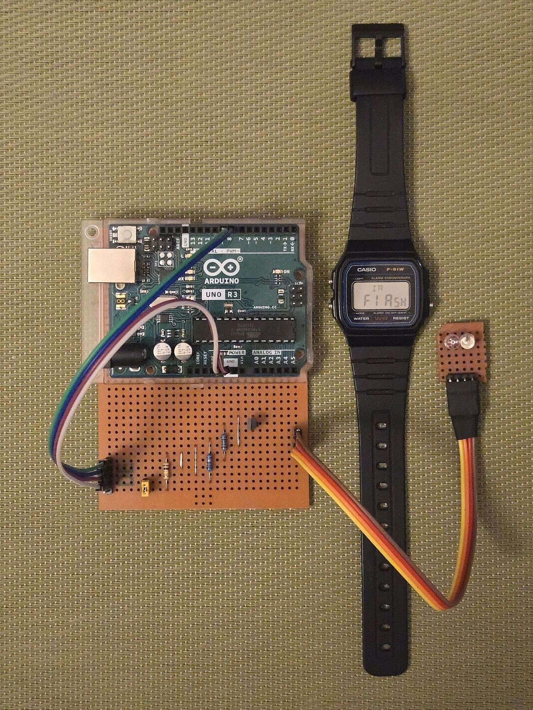
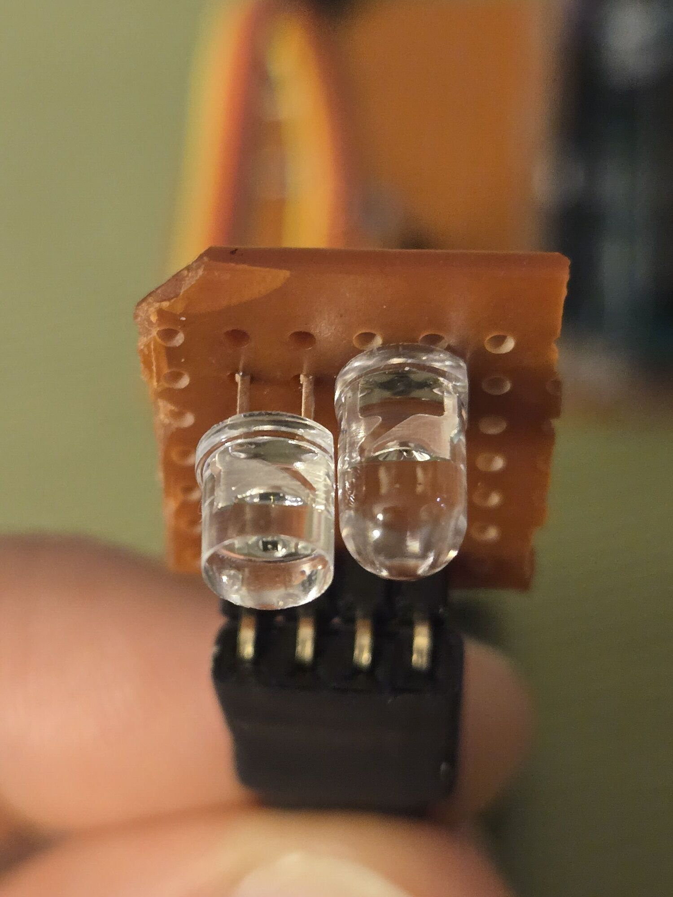
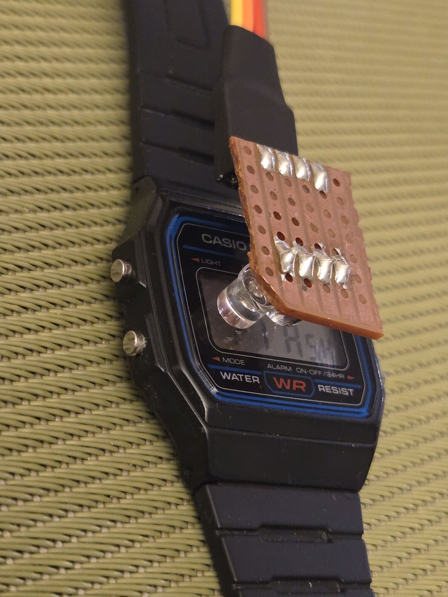

# sensor-watch-ir-tools

Tools to establish two-way communication with a Sensor Watch pro, leveraging its onboard phototransistor and red LED.

The most interesting application is the ability to flash a new firmware onto the watch completely wirelessly, without needing to open and disassemble the watch.

> **Early prototype.** This works end-to-end on the bench (a full image and a delta
> patch have both flashed successfully on a `sensorwatch_pro`), but it is rough: you
> have to build a small probe yourself, the return link is finicky, and the watch must
> be running a development branch of the firmware. These instructions are written for
> the handful of early testers building the rig for the first time. Expect to fiddle.

The host tooling here pairs with the watch-side faces that can be found at the **`ir-comms`** branch of my [second-movement](https://github.com/alesgenova/second-movement/tree/ir-comms) fork:
- `firmware_flasher_face` and `firmware_flasher.py` to perform firmware updates
- `ir_rx_face` and `test_tx.py` to test out sending data to the watch
- `ir_tx_face` and `test_rx.py` to test out receiveing data from the watch

---

## 1. Get the code and run the flasher

```bash
git clone https://github.com/alesgenova/sensor-watch-ir-tools.git
cd sensor-watch-ir-tools

# Python deps (a venv is recommended)
python3 -m venv .venv
source .venv/bin/activate
pip install pyserial          # always required
pip install detools           # for delta-patch flashing
```

### Build & flash the modem firmware

The modem firmware is built with [PlatformIO](https://platformio.org/). Pick the env
that matches your board, plug it in over USB, and upload:

```bash
pio run -e modem_arduino_uno  -t upload     # Arduino UNO
# or
pio run -e modem_xiao_samd21  -t upload     # Seeed XIAO SAMD21
```

Both modems are **identical from the host's point of view**: the Python script talks to
either one unchanged.

### Flash the watch

1. On the watch, open the **firmware-flasher face** and press the alarm button to get the watch ready to receive a new firmware.
2. Line up the probe over the watch's display (see the [photos](#the-prototype-flasher) and [video](#video-walkthrough) instructions)
3. Start the flasher script:

```bash
# Full flash of a fresh image:
bin/firmware_flasher.py firmware.uf2

# Delta patch against the firmware already on the watch:
bin/firmware_flasher.py new.uf2 --reference current.uf2
```

The defaults (NRZ encoding, 3600 baud data / 300 baud ACK) are the
[known-good settings](#default-settings) found by bench testing, don't change them unless you know what you're doing.

---

## Video walkthrough

Achieving a reliable two-way optical link can be hard on the first try. The transmission from the watch to the flasher is especially finnicky.

Follow this instructions video and you should be able to systematically achieve a solid link:

▶️ **[Instructions Video](img/instructions_540p.mp4)**

1. Start in a dimly lit room
2. Place the probe on the watch face, with the phototransistor flat against the watch glass
3. Nudge the probe around until you see the watch red LED flashing about once per second, indicating that the watch is receiving data correctly
4. Progressively increase the amount of light in the room, until you start reliably receiving data back from the watch.

---

## The prototype flasher

The whole rig is an Arduino UNO (or XIAO SAMD21), and some basic circuit to drive a IR led and a phototransistor:


Parts used in the prototype rig:

| Ref | Part / value | Notes |
|-----|--------------|-------|
| Q1 | 2N3904 | NPN transistor switching the IR LED |
| R1 | 22 Ω | IR LED current-limiting resistor |
| R2 | 1 kΩ | Q1 base resistor |
| R3 | 100 kΩ | Phototransistor pull-up resistor |

Pins to use on the MCU with the provided modem firmware:

|             | UNO Pin | XIAO Pin |
|-------------|---------|----------|
| VCC         | 5V      | 3.3V     |
| TX (IR LED) | D9      | D1       |
| RX (PT)     | D8      | D8       |


<p>
  
  
  
</p>

---

## Default settings

These were found by hardware testing and are the script's and watch face defaults. Don't change them unless you know what you're doing.

**Host (`bin/firmware_flasher.py`):**

| Flag | Value | Meaning |
|------|-------|---------|
| `--encoding` | `nrz` | line coding, both directions |
| `--baud` | `3600` | data, host → watch (watch RX baud) |
| `--ack-baud` | `300` | ACK, watch → host (watch TX baud) |
| `--timeout` | `0.5` | per-frame ACK timeout (s) |
| `--settle` | `0.0` | host inter-frame delay (the watch's ACK settle does this) |

**Watch (`firmware_flasher_face` menu):**

| Page | Value |
|------|-------|
| `rbAUd` (RX baud) | 3600 |
| `tbAUd` (TX baud) | 300 |
| `EncOd` (encoding) | `nrZ` |
| `PoLL` (RX poll rate) | 8 Hz |
| `AcrAt` (ACK tick rate) | 64 Hz |
| `SEtLE` (ACK settle) | 4 ticks (≈ 62 ms) |
| `Acnt` (ACK repeat count) | 1 |

---

## Appendix

### The data frame

Every host → watch message travels in a fixed wire frame (defined in
`bin/serial_frame.py`, mirrored in the watch's `serial_frame.c`):

```
+----------+---------+-------------+---------+---------+
| preamble | id      | len + flags | payload | crc32   |
| 4 bytes  | 2 bytes | 2 bytes     | N bytes | 4 bytes |
+----------+---------+-------------+---------+---------+
            <------ CRC32 covers this ------>
```

- **preamble**: the fixed marker `AA 55 AA 55`. The receiver is a byte-fed state
  machine that hunts for this sequence, so it can find frame boundaries in a noisy
  stream and re-synchronise after any optical dropout.
- **id**: `uint16` (little-endian), application-defined. For data blocks it's a
  running counter (0, 1, 2, …). The control frames are identified by their flag
  bits (not their id); the host also gives them reserved ids by convention
  (`0xFFFF` = ENTER, `0xFFFE` = EXIT), which the watch just echoes in the ACK.
- **len + flags**: the low 10 bits are the payload length (capped at 512 bytes by
  `MAX_PAYLOAD`); the top 6 bits are flag bits (TEST, ENTER, VERIFY, PATCH).
- **payload**: padded up to a 4-byte boundary; the padding is covered by the CRC
  but not delivered. A declared length of 0 means no payload bytes on the wire.
- **crc32**: a standard CRC-32 (the same as `zlib.crc32`) computed over the id,
  the len+flags field, and the padded payload, i.e. everything **except** the
  preamble and the CRC itself.

**How corruption is caught.** The receiver recomputes the CRC-32 over the bytes it
got and compares it to the trailing CRC. Any single flipped bit anywhere in the id,
length, flags, or payload changes the computed CRC, so the frame fails the check and
is **discarded**, never delivered to the flasher. A frame with a nonsensical length
field (noise that happened to match the preamble) is rejected outright and the parser
resyncs. Because the preamble is a distinct marker and the machine resyncs on any
mismatch, a garbled or partial frame can't be mistaken for a good one: worst case it
fails CRC and the sender, having received no acknowledgement, retransmits it.

**The acknowledgement (watch → host)** is *not* a frame: the watch replies to a valid
frame with the bare 2-byte id (little-endian), raw, with no preamble or CRC. This is
self-validating. The host is waiting for one specific id (the one it just sent), so
a corrupted ACK simply fails to match and the frame is retried, while a matching id is
proof the frame arrived intact (the watch only ACKs *after* the frame passed its own
CRC). On the weak watch → host path the watch can repeat the id several times per ACK
(the `Acnt` knob); the host scans a small sliding window for any intact copy.

### Flasher logic flow

1. **Link test (test + ACK).** The host sends the first few firmware blocks as
   `TEST`-flagged frames. The watch validates each, echoes its id, but does **not**
   write it to flash. Each frame is retransmitted up to `--retries` times (default 50).
   This finite limit is unique to the test phase (real data blocks are retried forever);
   the test fails only if a frame still can't be ACKed after all its retries, and the
   retransmit counts are reported so you can gauge link quality before committing. This
   proves the full round-trip (both the host → watch data path and the finicky
   watch → host ACK path) *before* anything irreversible happens.

2. **ENTER command.** Once the test passes, the host sends an `ENTER` frame (id
   `0xFFFF`, FLAG_ENTER, empty payload), retransmitting until it's ACKed. ENTER drops
   the watch out of its normal Movement-scheduled test stage and hands control to the
   RAM-resident flasher. The ACK is sent before the hand-off, so a lost ENTER-ACK just
   makes the host resend, which is harmless; a repeated ENTER never re-enters the flasher.
   *(With `--reference` the ENTER instead carries a 20-byte patch header, and the watch
   ACKs it only if its current flash matches the reference (otherwise the patch is
   refused); the data frames then stream a compressed delta applied in place.)*

3. **RAM-resident flasher (`.ramfunc`).** While the flash controller is erasing or
   programming a row, the CPU can't fetch instructions from flash, so the entire
   flashing loop lives in a `.ramfunc` section copied to RAM at boot. On entry it
   disables interrupts, closes the normal optical driver and brings the RX/TX SERCOMs
   up raw, disables the flash cache (so the read-back verify sees true flash), and
   sleeps in STANDBY between bytes. From here the watch is off Movement's event loop
   entirely.

4. **Data frames.** The firmware streams in as data blocks: id = running counter,
   payload = a 4-byte target flash address + one 256-byte flash row. For each block
   the watch erases the target row, programs it, then ACKs by echoing the id. It's
   stop-and-wait with de-duplication: a repeat of the last-written id is just re-ACKed
   (lost-ACK recovery), the next id is written and advances the counter, and a failed
   write sends no ACK so the host retransmits forever, because the watch never gives
   up mid-flash.

5. **EXIT command.** After the last block the host sends an `EXIT` frame (id `0xFFFE`,
   FLAG_VERIFY, a 12-byte descriptor = base address, total length, whole-image CRC-32).
   The watch CRCs the flash region it just wrote and compares. **Match** → it echoes the
   id and reboots straight into the new firmware. **Mismatch** → it stays silent and
   parked in the `.ramfunc` (it never reboots into a half-written image), and the host
   reports the failure and offers to resend. There is deliberately **no stall timeout**:
   an abandoned session just sits parked in RAM, still reachable over the link, rather
   than rebooting into a possibly-bricked image.

> **Recovery.** The watch never leaves the `.ramfunc` flasher until a final verification
> passes; it only reboots on an EXIT whose CRC matches. Until then, the host can restart
> the entire write at any time simply by sending a data block with **id = 0**: the watch
> resets its sequence counter and begins writing from the top again. So even if a flash is
> interrupted, an EXIT fails to verify, or a write goes wrong partway through, the firmware
> can just be re-sent, making it almost always possible to recover the watch to a working
> state without ever opening it.

### IrDA vs NRZ encoding

The link can run in either of two line encodings (chosen with `--encoding`, and matched
on the watch): **IrDA** (SIR pulse coding) or plain **NRZ** (a normal UART line). The
default is NRZ, which is slightly counter-intuitive, since IrDA is the one designed to
save power.

In IrDA SIR the line idles LOW and each `0` bit is sent as a brief HIGH pulse lasting
only 3/16 of a bit period. On a typical active-HIGH LED (LED on when the line is HIGH)
that is exactly the low-power trick it's meant to be: the LED sits dark at idle and
flashes on only for those short pulses.

The catch is that the Sensor Watch's red LED is wired **active-LOW**: it lights when the
line is LOW. That inverts IrDA's intent. The idle-LOW line now keeps the LED **lit** most
of the time (scope-measured at roughly 80% duty), blinking *off* for each pulse instead
of on. So on this hardware IrDA is actually the power-*hungry* option, it maximises
LED-on time rather than minimising it. (The link still works because the IrDA receiver
keys off pulse edges/position, not absolute light level.)

NRZ does the opposite: the line idles HIGH, so the LED is **off** at idle and only pulled
on for start/data bits. During a flash the line is idle far more often than not (between
bytes and between frames), so NRZ keeps the LED dark most of the time. It tested just as
reliably as IrDA on this jig, so it's the default, and it's gentler on the coin cell.

### AI disclaimer

Claude Code was used in the creation of this project. The
design, logic, and verification are my own.

---

## TODO
- [] Improve the RX circuit on the flasher side (photodiode + amplifier?)
- [] Improve the efficiency of the patch mode, with better diff and compression algorithms
- [] Design a better housing for the flasher probe, so it can be placed more consistently and reliably on the watch
